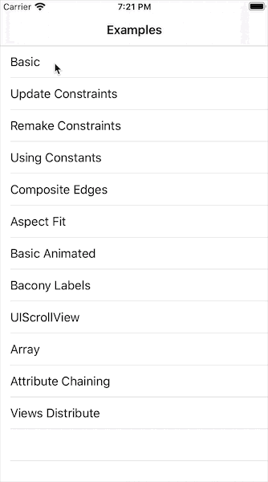

# BMAutoLayout
Objective-C Anchor-based layout

由于 Masonry 的作者不再维护OC版本的自动布局库，而Apple早已从繁杂的布局接口更换为基于NSLayoutAnchor的布局，由于工作需求，于是我仿照Masonry写了一套和Masonry API相同的代码，其内部核心代码使用NSLayoutAnhcor布局, 本代码支持iOS9.0及其以上版本。   
注意`safeAreaLayoutGuide`是`iOS11.0`之后推出， 因此代码如果用到了`safeAreaLayoutGuide`，要确保当前系统大于或等于`iOS 11.0`  


### 调用示例： 

```
#import <BMAutoLayout/BMAutoLayout.h>

self.topView = [[UIView alloc] initWithFrame:CGRectZero];
self.topInnerView = [[UIView alloc] initWithFrame:CGRectZero];
self.bottomView = [[UIView alloc] initWithFrame:CGRectZero];
self.bottomInnerView = [[UIView alloc] initWithFrame:CGRectZero];

// Set background colors
UIColor *blueColor = [UIColor colorWithRed:0.663 green:0.796 blue:0.996 alpha:1];
[self.topView setBackgroundColor:blueColor];

UIColor *lightGreenColor = [UIColor colorWithRed:0.784 green:0.992 blue:0.851 alpha:1];
[self.topInnerView setBackgroundColor:lightGreenColor];

UIColor *pinkColor = [UIColor colorWithRed:0.992 green:0.804 blue:0.941 alpha:1];
[self.bottomView setBackgroundColor:pinkColor];

UIColor *darkGreenColor = [UIColor colorWithRed:0.443 green:0.780 blue:0.337 alpha:1];
[self.bottomInnerView setBackgroundColor:darkGreenColor];

// Layout top and bottom views to each take up half of the window
[self addSubview:self.topView];

[self.topView bm_makeConstraints:^(BMConstraintMaker *make) {
    make.left.right.top.equalTo(self);
}];

[self addSubview:self.bottomView];
[self.bottomView bm_makeConstraints:^(BMConstraintMaker *make) {
    make.left.right.bottom.equalTo(self);
    make.top.equalTo(self.topView.bottomAnchor);
    make.height.equalTo(self.topView);
}];

// Inner views are configured for aspect fit with ratio of 3:1
[self.topView addSubview:self.topInnerView];

[self.topInnerView bm_makeConstraints:^(BMConstraintMaker *make) {
    make.width.equalTo(self.topInnerView.heightAnchor).multipliedBy(3);
    make.width.height.lessThanOrEqualTo(self.topView);
    make.width.height.equalTo(self.topView).priorityLow();
    make.center.equalTo(self.topView);
}];

[self.bottomView addSubview:self.bottomInnerView];
[self.bottomInnerView bm_makeConstraints:^(BMConstraintMaker *make) {
    make.height.equalTo(self.bottomInnerView.widthAnchor).multipliedBy(3);
    make.width.height.lessThanOrEqualTo(self.bottomView);
    make.width.height.equalTo(self.bottomView).priorityLow();
    make.center.equalTo(self.bottomView);
}];
```

